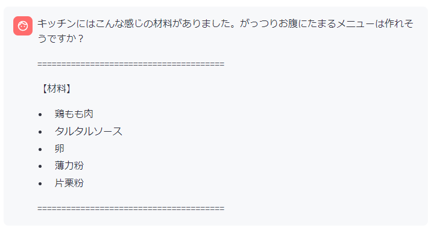
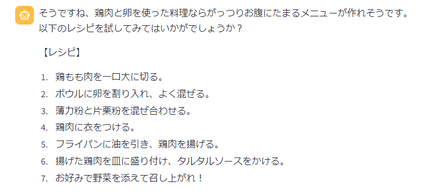
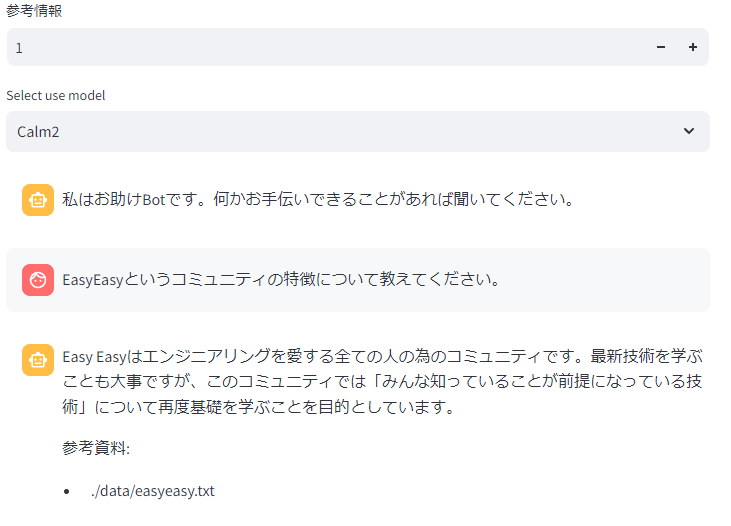
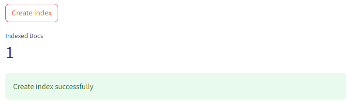
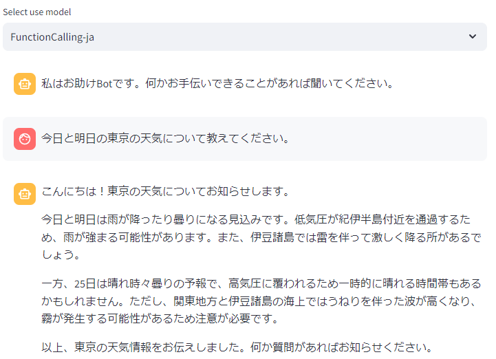

# LLM Chat Playbook

ローカルLLMを使って各種機能を試すサンプルコード

## System Requirements

|||
|-|-|
|CPU|6 Core(Ryzen)|
|Memory|16GB|

## Quick Start

```bash
$ make all
```

open http://localhost:8503

## Multi Turns Chat





## RAG

参考情報を1以上にしてチャットを打つと、閾値以上の類似度のドキュメントがあれば、そのテキストを参照して回答を生成する。



### インデックスデータの作成

`data` ディレクトリ配下にインデックスさせたい `.txt` や `.pdf` を配置する。

```bash
$ tree data/
data/
└── easyeasy.txt
```

Create Indexボタンを押す。
しばらく待つとインデックスデータが作成される。



※大量のデータやサイズの大きいPDFファイルをインデックスしようとすると、処理に失敗してシステムがクラッシュすることがあるので注意

## Function Calling

ModelタイプでFunctionCallingを選択すると外部APIを呼んで回答を生成する。
本サンプルコードでは天気APIを参照して、指定した地域の天気を回答する。



## Released Models

別のモデルを扱いたいときは、以下から選択すると良い。
すべてのモデルが日本語対応しているわけではないで注意。

https://huggingface.co/models?library=gguf&sort=likes

## Special Thanks

- https://weather.tsukumijima.net/
- https://easy2.connpass.com/
